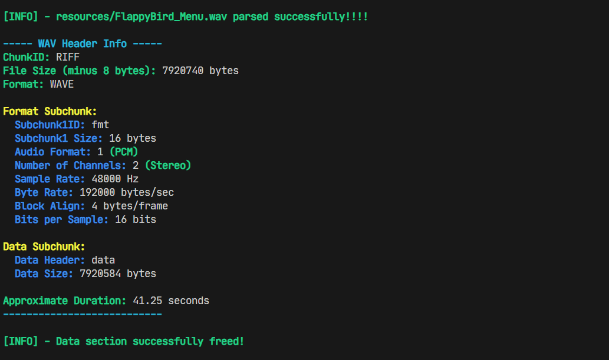

# Simple WAV File Parser and Player in C

`c-wav-player` is a lightweight WAV file parser and Win32 sound player written in C. It reads standard RIFF/WAV headers, skips non-audio metadata chunks (such as smpl, LIST, etc.), and extracts raw PCM audio data for playback via the Windows waveOut API.

## Features

- Reads and validates WAV headers
- Supports 16-bit PCM, stereo and mono
- Skips unknown chunks safely (robust RIFF parsing)
- Prints header information and duration
- Play audio (via soundplayer.h)

## Usage Example 

### Wav Parser

```c
#include "wav_parser.h"

int main(int argc, char const *argv[])
{
    wav_file_t file;
    wav_init_file(&file);

    if(!wav_parse_file("resources/sound/FlappyBird_Menu.wav", &file)) {
        return 1; //better err code comming soon
    }

    //using wav file data...

    wav_free_file(&file);
    return 0;
}
```

### Win32 Soundplayer(using the wav parser)
```c
#include "win32/soundplayer.h"

int main(int argc, char const *argv[])
{
    Sound* snd = sound_init("resources/sound/bass-wiggle.wav");
    play_sound(snd);

    while(sound_is_playing(snd)) {
        draw_ui();
    }

    sound_release(snd);
    return 0;
}
```

## WAV parser (header data display)

|          WAV header data                              |
|-------------------------------------------------------|
|                     |

## License

This project is open source and free to use under the [MIT License](LICENSE).

